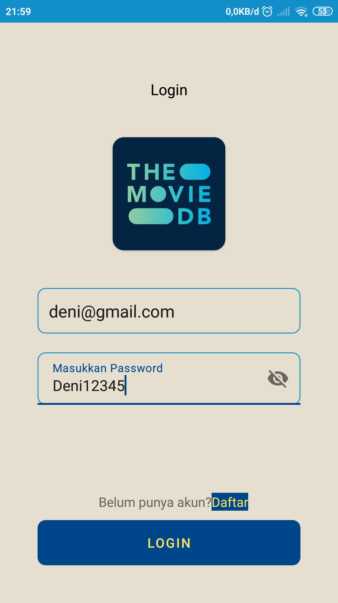
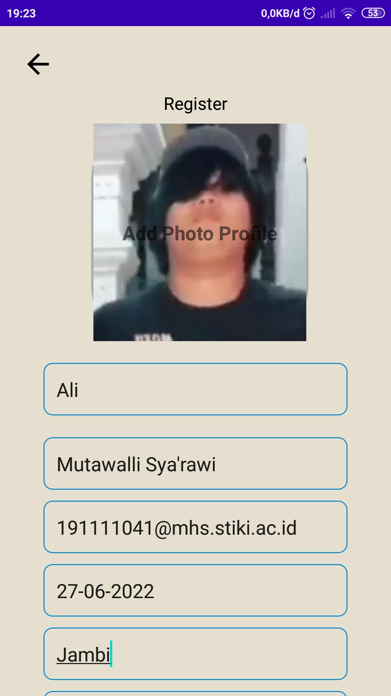
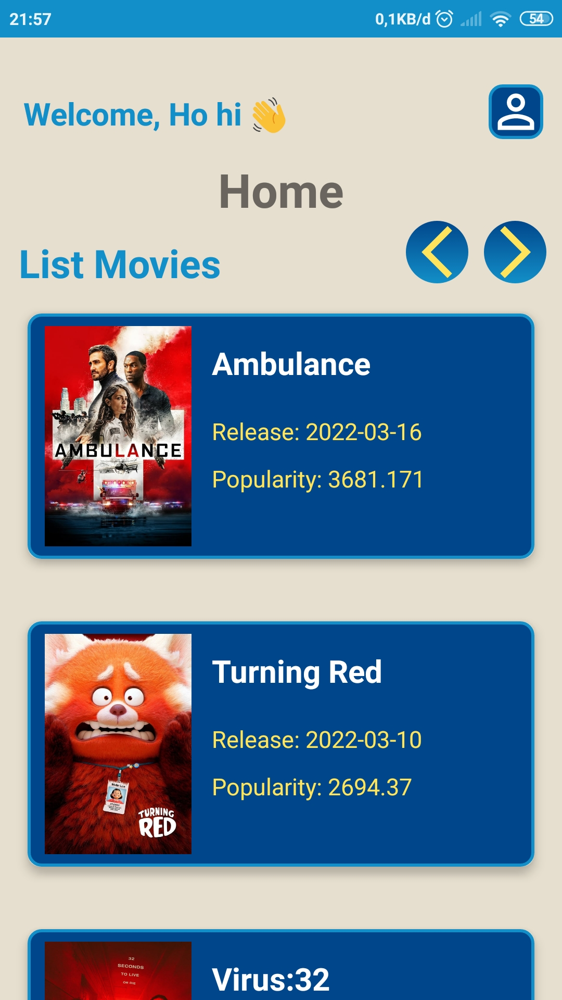
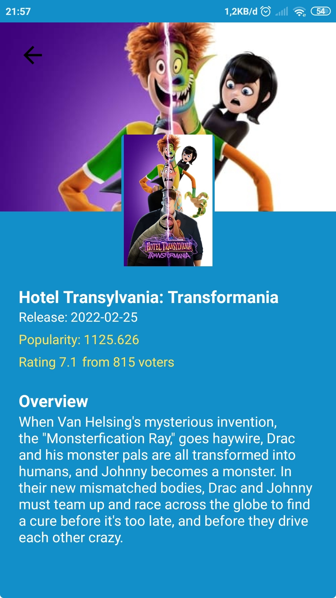
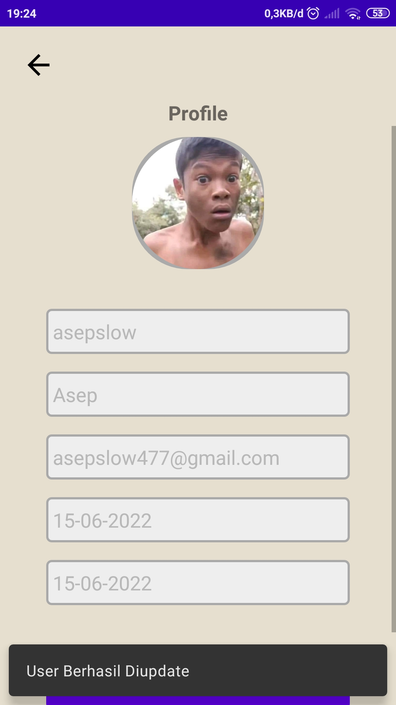
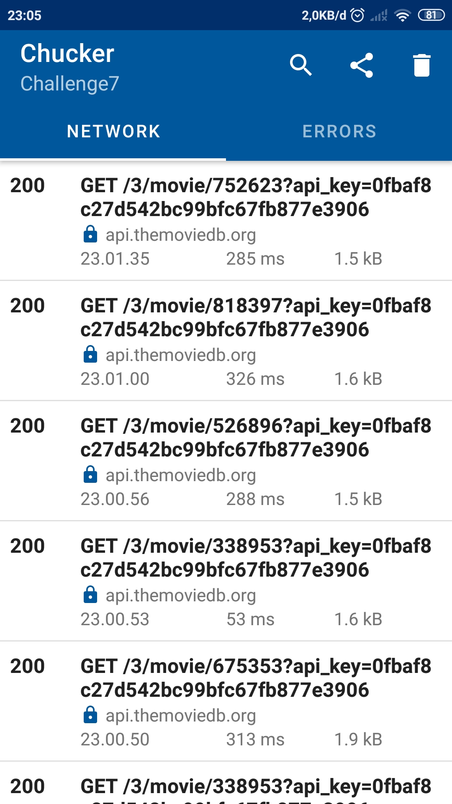

# Challenge-Chapter-7

## About
An Android Developer is a Software Developer who specializes in designing applications for the Android marketplace. 
This means most of an Android Developer’s job revolves around creating the apps we use on our smartphones and tablets. 
Android Developers can either work in-house for a large organization, or they can be employed by an App Development agency.

This application was originally created by Muhammad Mutawalli Sya'rawi For Complete Challenge Chapter 7 about Dependency Injection, Chucker, Testing, and Build Flavor.

Keep Breathing and Stay Awesome, Peace :v:

# Screenshot
## Here some screenshot of the program.

Login                      |  Register                 |  Home (List Movies)
:-------------------------:|:-------------------------:|:-------------------------:
     |     |  

Movies Detail              |  Profile Update           |  Chucker
:-------------------------:|:-------------------------:|:-------------------------:
     |     |  

## Here Some Demo of The Program.

https://user-images.githubusercontent.com/81089455/176230735-551010b8-790a-4081-b3cc-1d478388d5cc.mp4
